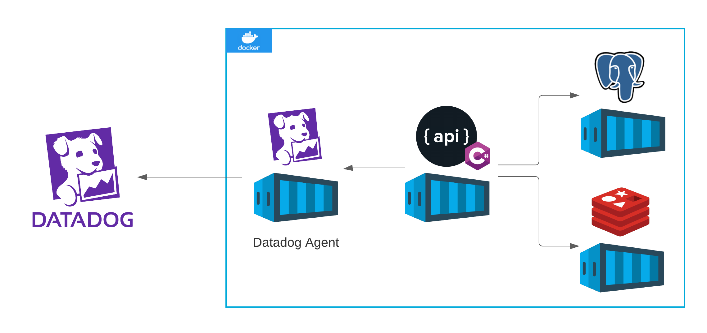
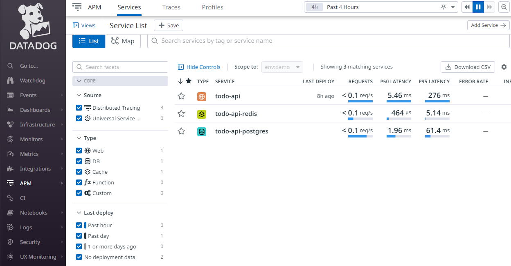
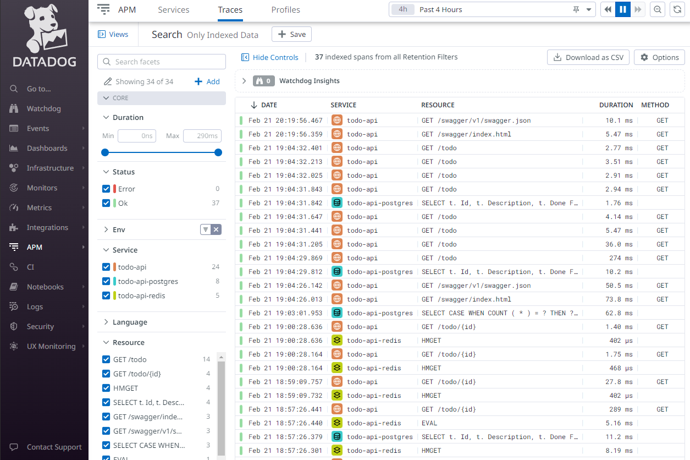
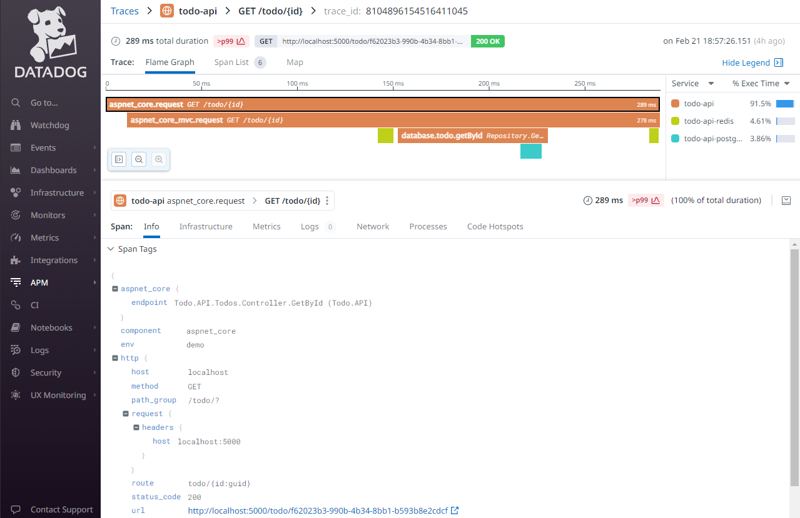

## Observability With Datadog

## Give a Star! :star:

If you liked my work and want to support me, please give it a star. Thanks!

## Introduction

Over the last years we've been discovering the _Microservices World_. The idea of to decouple the monoliths into small, more manageable, pieces and the already born microservices has allow us to have more granular scalability, faster deploys, technology adoption for each service over demand, and many other benefits. 

But, as we've be listening over years, there is no such a thing as a silver bullet for all problems, and everything has a tradeoff. 

A big challenge in software development industry, that have significantly increased in the Microservices World, is **observability**. **How to trace a complex flow that pass through a lot of services and components like databases, queues and cache? How to make sense of logs and correlate then to events? How to get metrics about resource consumption, latency and more?**

### Datadog
Datadog is a **Software as a Service (SaaS)** platform that help us with that and many more observability challenges. As some of the main features that Datadog provides we have: **traces about request lifecycle**, **metrics**, **logs**, **alerts**, **dependency maps** and more. For that we need to instrument our applications via **Integrations** or with **the Datadog Agent** to send data to Datadog that will this data to provide us **insights about the internal state of our applications**.

## 1. Architecture



For this sandbox I have a containerized environment with a **Postgres Database**, a **Redis** instance, an **ASP.NET Core API**, and the **Datadog Agent**. 

Inside the API container, as we can identify on this [Dockerfile](Todo.API/Dockerfile), we need to install the **dd-trace agent** and specify some environment variables to allow Datadog Agent to collect data. On [docker-compose.yml](docker-compose.yml) we need to add some environment variables on api service to Datadog Agent be able to identify the **service name**, **environment**, and **version**, and to make some extra configurations. 

Notice that there is no need to make any configuration for the Database or Cache services, the API configuration its enough to Datadog Agent to identify the dependent services and to collect data about then too. 

## 2. How to Run :rocket:

### Configure

Replace _REPLACE_WITH_A_DATADOG_API_KEY_ key on [docker-compose.yml](docker-compose.yml) file with a **Datadog Application Key**. For information about how to generate an Application key on Datadog read this [article](https://docs.datadoghq.com/account_management/api-app-keys/).

### App
```
docker-compose up -d
```

### Swagger
```
http://localhost:5000/swagger
```

### Generating Data
Execute some endpoint calls to generate data to Datadog. **Its also important to notice that data is not sent to DataDog in realtime, there is some minimal delay.** 

## 3. Results

### Services


### Traces


### Trace Details
